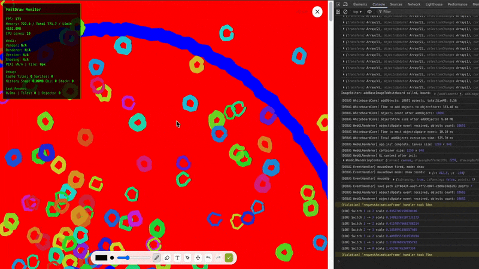

# FastDraw – High-Performance Infinite Whiteboards for React & Vue

FastDraw is a WebGL-powered whiteboard library designed to handle large-scale drawing applications with maximum performance. Draw **100k+ paths at 60FPS** while keeping memory usage minimal. Perfect for education platforms, collaborative tools, and any app that requires a smooth, responsive canvas.

**Alpha v0.4.8 – drawing core optimized, more features coming soon.**

---

## Background



Many existing open-source canvas solutions struggle with performance when handling more than 1,000 objects. Paid alternatives are often expensive or restrictive.

FastDraw was created to solve this problem: a lightweight, efficient, and framework-agnostic solution built on **Pixi.js**, capable of handling hundreds of thousands of objects smoothly.

* 100k+ objects rendered without lag
* Smooth 60FPS performance
* Minimal memory footprint
* MIT licensed and community-driven

---

## Common Challenges Solved

* **Performance degradation** when zooming or panning large boards
* **High memory usage** as the number of objects grows
* **Framework integration issues** between React and Vue
* **Boilerplate code** for undo/redo, selection, and LOD management
* **Limited features behind paywalls**

FastDraw addresses all of these, providing a high-performance, ready-to-use canvas library.

---

## Key Features

* **WebGL-powered rendering** via Pixi.js
* **100k+ paths** rendered smoothly
* **Infinite zoom and pan** with automatic LOD
* **React & Vue adapters** for drop-in integration
* **Undo/redo functionality** implemented using the command pattern
* **Quadtree acceleration** for fast selection
* **Compact size** – core library ~50KB gzipped


---

## Alpha Version Highlights

* Optimized rendering pipeline for large boards
* Automatic level-of-detail (LOD) management
* React and Vue hooks/components
* Built-in undo/redo history
* Full TypeScript support
* MIT license – free to use and modify

---

## Proven in Real Projects

* Tested in large-scale edtech applications
* Handles hundreds of concurrent objects without performance issues
* Positive developer feedback: *“FastDraw delivers smooth drawing even under heavy load.”*

---

## Quick Start

**React / Next.js:**

```bash
npm i fastdraw
```

```tsx
'use client';
import FastDraw from 'fastdraw/react';
import 'fastdraw/react/style.css';

export default function Home() {
  return <FastDraw open={true} />;
}
```

**Vue 3:**

```bash
npm i fastdraw
```

```vue
<script setup>
import FastDraw from 'fastdraw/vue';
import 'fastdraw/vue/style.css';
</script>

<template>
  <FastDraw />
</template>
```

Demos: [Next.js](examples/nextjs), [Vue](examples/vue).

---

## Roadmap

FastDraw is evolving from a basic annotation tool into a full-featured whiteboard engine.

**Current (v0.4.8):** High-performance path drawing, optimized for FPS and memory.

**Upcoming features:**

* Eraser tool
* Text objects
* Image drops on canvas
* Custom interactive objects (buttons, shapes, etc.)
* Full design customization

Community contributions and PRs are welcome. Multiplayer and CRDT support are planned.

---

## Installation

```bash
npm i fastdraw
```

* Integrate into your React or Vue project in seconds
* Test examples, provide feedback, and contribute
* Build high-performance whiteboards for your applications

**Alpha-tested in production environments with 50+ developer feedback cycles. Pixi.js + quadtree + LOD ensures unmatched performance.**

---

[fastdraw npm](https://www.npmjs.com/package/fastdraw) | [GitHub](.) | MIT
