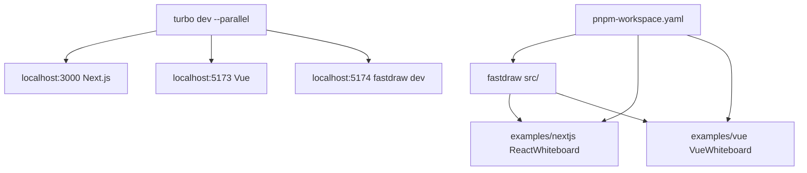

# FastDraw Monorepo

## Структура

```
fastdraw-monorepo/
├── pnpm-workspace.yaml
├── turbo.json
├── package.json
├── tsconfig.json
├── fastdraw/                 # Основная библиотека
│   ├── src/
│   ├── package.json
│   ├── vite.config.ts
│   └── ...
├── examples/
│   ├── nextjs/              # Next.js + React пример
│   │   ├── src/app/page.tsx # Импорт: import Whiteboard from 'fastdraw/adapters/react/Whiteboard'
│   │   ├── next.config.ts   # transpilePackages: ['fastdraw']
│   │   └── ...
│   └── vue/                 # Vite + Vue пример
│       ├── src/App.vue      # Импорт: import Whiteboard from 'fastdraw/adapters/vue/Whiteboard'
│       └── ...
└── plans/
    └── fastdraw-monorepo.md
```



## Инструкции по запуску

1. **Установка зависимостей:**
   ```
   pnpm install
   ```

2. **Разработка с hot-reload (параллельно):**
   ```
   pnpm dev
   ```
   - Next.js: [http://localhost:3000](http://localhost:3000) – кнопка открывает React Whiteboard
   - Vue: [http://localhost:5173](http://localhost:5173) – кнопка открывает Vue Whiteboard
   - fastdraw dev: [http://localhost:5174](http://localhost:5174) – для проверки библиотеки

3. **Билд:**
   ```
   pnpm build
   ```

4. **Тестирование:**
   - Изменения в `fastdraw/src/` автоматически применяются в примерах (symlink workspace:* + vite dev)
   - Next.js transpiles fastdraw src благодаря `transpilePackages`
   - Vue/Vite обрабатывает .vue/.tsx из workspace

## Зависимости и конфигурация

- **pnpm-workspace.yaml:** `packages: - 'fastdraw' - 'examples/*'`
- **turbo.json:** `dev` persistent для HMR, `build` outputs dist/** .next/**
- **fastdraw/package.json exports:** (src для dev) + publishConfig для dist
- **tsconfig.json:** paths для типизации `fastdraw/*` -> `fastdraw/src/*`

Monorepo готов для разработки и тестирования плагина на React/Next.js и Vue/Vite.